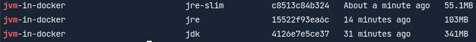

# jvm-in-docker
A repo to demonstrate how to use jlink

---

To build image with JDK:
`docker build -t jvm-in-docker:jdk -f jdk.dockerfile .`

To run JDK image:
`docker run --rm -p 8080:8080 jvm-in-docker:jdk`

---

To build JRE image:
`docker build -t jvm-in-docker:jre -f jre.dockerfile .`

To run JRE image:
`docker run --rm -p 8080:8080 jvm-in-docker:jre`

---

To analyze dependencies:
```shell
mkdir app
cd ./app
unzip ../app.jar
cd ..
jdeps --print-module-deps --ignore-missing-deps --recursive --multi-release 17 --class-path ./app/BOOT-INF/lib/* ./app.jar
rm -Rf ./app
```

Should give you:

`java.base,java.management,java.naming,java.net.http,java.security.jgss,java.security.sasl,java.sql,jdk.httpserver,jdk.unsupported`

To build slim JRE image:
`docker build -t jvm-in-docker:jre-slim -f jre-slim.dockerfile .`

To run slim JRE image:
`docker run --rm -p 8080:8080 jvm-in-docker:jre-slim`

---

To build slim JRE image with automated dependency analysis:
`docker build -t jvm-in-docker:jre-slim -f jre-slim-auto.dockerfile .`

--


